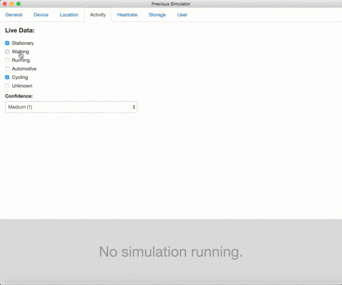
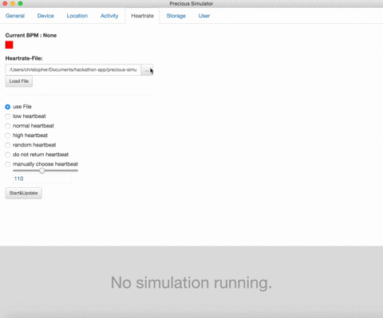

# PRECIOUS Simulator

## Introduction

The PRECIOUS Simulator is a development environment for mobile apps running in a dedicated **sandbox** within our own PRECIOUS health application. Instead of having the user install a multitude of different health-related apps, we provide a single point-of-entry to achieve health related goals. At the same time, user-information can never leave the sandbox, thus achieving maximum privacy and security as access to the user's information can be controlled rigorously. 

## Concept

Apps running within PRECIOUS can be created using **HTML, CSS and Javascript**. We provide an easy-to-use API to access native sensor information and other useful information about the user. The PRECIOUS Simulator emulates this environment and lets developers test their applications before release. The API is provided via an **automatically injected** javascript file that is loaded at runtime, so there is **no need** to include any dependencies yourself. The Simulator is written using [Electron](http://electron.atom.io/).

Here is a screenshot of the main windows.


## Requirements

### Executables

We generally provide pre-built executables for  Windows, MacOSX and Linux. These can be found in the `build` folder. Please select according to your OS and architecture and simply start the respective executable.

### Build yourself

The simulator can be easily built yourself. The only dependency required is [Node.js](https://nodejs.org/en/). As me make extensive use of ES5/ES6, we recommend at least version `5.5.0` to build yourself. If you have other local versions of node, we recommend to use [NVM](https://github.com/creationix/nvm) in order to manage between different version.

* Simply clone the github repository via 

<!-- git clone -->

    git clone https://github.com/preciousproject/precious-simulator
   
* Go to the `simulator` folder and install dependencies via

<!-- npm install -->

    npm install
  
* Run via 

<!-- npm start -->

    npm start

Alternatively you can build the tool to an executable yourself by running

    grunt build
    
This will build the simulator for all platforms, so adjust the gruntfile accordingly for your platform (recommended only for people who know what they are doing). 

## API

In the following we will provide an overview of the API methods that are available for building your own app. 

### General

In general, there are - depending on the type of data - three different types of requests that can be made:

* **Single Value Retreival** - this method returns a requested value once, i.e. requesting the current battery status
* **Continuous Value Retreival** - this method return a requested value continously, i.e. new values will be provided to your callback whenever they are availbale, i.e. requesting the battery status continously will result in your callback being called whenever the battery percentage changes
* **Continous Value Retreival Removal** - each call to the *Continuous Value Retreival* method returns a unique request ID. This ID can be used to remove a previously issued continuous request, i.e. you don't need regular updates on the device's battery status anymore.

---

Each of the API method has at least two arguments 

* `callback(error, response)` - this is a function you need to provide that will be executed with either an error, or a response

An example callback for the GPS plugin looks as follows

```javascript
function logGpsCoordinates(error, response) {
	if (error != null) {
		console.log(error.errorCode, error.msg)
			return;
    	}
    	console.log(response.latitude, response.longitude)
    }
    
Precious.getGPS(logGpsCoordinates);
```

The `callback` function is called with two arguments, `error` and `response`. In case the request succeeded, `error` will be set to `null` and you can check for that as seen in the example above. `response` is an object containing keys and values according to the respective call that has been made.

* `userInfo` - this **optional** argument that you can provide and which is being passed around for your convenience. The following shows an example on how to access your own `userInfo` object from within your callback

<!-- example -->	

```javascript
function log(error, response) {
	if (error != null || typeof response.userInfo !== 'undefined') {
		console.log(response.userInfo.myKey);
	}
}

Precious.getGPS(log, { myKey: 'importantPropertyForThisCall' });
```

---

Continous requests are also part of the API, and constantly execute the callback function whenever new data is available. In addition, continuous requests return a **unique request ID** which can be stored and used to remove the request again. The following example shows this functionality.

```javascript
var requestID = null;
var requestCounter = 0;

function removeRequest() {
	Precious.removeRequest(requestId, requestRemoved);
}

function requestRemoved(error, response) {
	if (error != null) {
		console(response)
	}
}

function log(error, response) {
	if (error != null && requestID != null) {
		removeRequest();
	}
	if (error != null) {
		console.log("Request " + requestCounter + ": " + response.latitude + "," + 
			response.longitude)
		requestCounter+=1;	
		if (requestCounter > 10) {
			removeRequest();
		}
	}
}

requestID = Precious.getContinuousGPS(logGpsCoordinates);
```

In this example, we first start a continuous request to retreive regular updates on GPS coordinates via `Precious.getContinuousGPS`, which returns a unique request ID. We store this ID in the `requestID` variable and use it in the `removeRequest` function to remove the request again via the provided `Precious.removeRequest`.


### User
---

#### Precious.getUserID
---

Returns the user's userID - which is unique among devices.

```javascript
Precious.getUserID(callback, userInfo)
```	

**Response Object**

```javascript
{
	userID: String 
}
```	
	
**Example callback**

```javascript
var callback = function(e,r) {
	console.log(r.userID)
}
```	

#### Precious.getUserBirthday
---

Returns the user's birthday.

```javascript
Precious.getUserBirthday(callback, userInfo)
```	

**Response Object**

```javascript
{
	birthday: Long // timestamp in ms 
}
```	
	
**Example callback**

```javascript
var callback = function(e,r) {
	console.log(r.birthday)
}
```	
	
#### Precious.getUserWeight
---

Returns the user's weight.

```javascript
Precious.getUserWeight(callback, userInfo)
```	

**Response Object**

```javascript
{
	weight: Int // value in kg
}
```	
	
**Example callback**

```javascript
var callback = function(e,r) {
	console.log(r.weight)
}
```	

### Device
---

#### Precious.getConnectivity
---

Returns a boolean value whether the device has current connectivity to the internet or not.

```javascript
Precious.getConnectivity(callback, userInfo)
Precious.getContinuousConnectivity(callback, userInfo)
```	
**Response Object**

```javascript
{
	connectivity: Boolean 
}
```	
	
**Example callback**

```javascript
var callback = function(e,r) {
	console.log(r.connectivity)
}
```	

#### Precious.getWifi	
---

Returns a boolean value whether the device is currently using a WiFi connection.

```javascript
Precious.getWifi(callback, userInfo)
Precious.getContinuousWifi(callback, userInfo)
```	

**Response Object**

```javascript
{
	wifi: Boolean 
}
```	

**Example callback**

```javascript
var callback = function(e,r) {
	console.log(r.wifi)
}
```	

#### Precious.getBattery
---

Returns an integer value [0;100] indicating the current battery level in %.

```javascript
Precious.getBattery(callback, userInfo)
Precious.getContinuousBattery(callback, userInfo)
```	
**Response Object**

```javascript
{
	battery: Integer 
}
```	

**Example callback**

```javascript
var callback = function(e,r) {
	console.log(r.battery)
}
```	

#### Precious.getVibration
---

Returns a boolean value whether the user has activated vibration as a possible interaction type. 

```javascript
Precious.getVibration(callback, userInfo)
Precious.getContinuousVibration(callback, userInfo)
```	

**Response Object**

```javascript
{
	vibration: Boolean 
}
```	
	
**Example callback**

```javascript
var callback = function(e,r) {
	console.log(r.vibration)
}
```	

### Storage
---

This API section deals with the possible ways of storing values using the PRECIOUS API. In a production environment, the values stored using this API are synchronized with the PRECIOUS backend, thus all values stored can be retreived from other devices. Storage is achieved using **key-value pairs**. 

#### Precious.getStorageEntry
---

Retreives a value for the specified `key` parameter.

```javascript
Precious.getStorageEntry(callback, key, userInfo)
```	

**Response Object**

```javascript
{
	value: Type or null (Type of the data that was stored using the key)
}
```	

**Example callback**

```javascript
var callback = function(e,r) {
	console.log(r.value)
}
```	

#### Precious.setStorageEntry
---

Sets the value `value` for the key `key` as specified in the arguments of the function call.

```javascript
Precious.setStorageEntry(callback, key, value, userInfo)
```	

The callback contains only an **empty response**.

#### Precious.removeStorageEntry
---

Removes the storage entry that was previously stored using the `key` value. 

```javascript
Precious.removeStorageEntry(callback, key, userInfo)
```	

The callback contains only an **empty response**.

---

**Example** 

```javascript
Precious.setStorageEntry(null, "dataKey", { myData: "This is my data"})
Precious.getStorageEntry(function(error, response) {
	console.log(response.value.myData) // = "This is my data"
}, "dataKey");
Precious.removeStorageEntry(null, "dataKey");
```	

### Location
---

#### Precious.getGPS
---

Retreives the user's current GPS coordinates. If location tracking is deactivated, an error is returned.

```javascript
Precious.getGPS(callback, params, userInfo)
Precious.getContinuousGPS(callback, userInfo)
```	
	
**Response Object**

```javascript
{
	latitude: Float // latitude in degrees
	longitude: Float // longitude in degrees
	altitude: Float or null // altitude in meters
	speed: Float or null // speed in km/h
	course: Float or null // bearing in degrees
	verticalAccuracy: Float // vertical accuracy in meters
	horizontalAccuracy: Float // horizontal accuracy in meters
	timestamp: Long // timestamp in milliseconds
}
```	

**Example callback**

```javascript
var callback = function(e,r) {
	console.log(r.latitude, r.longitude)
}
```	
	
### Heartrate
---

#### Precious.getHeartrate
---

Retreives the user's current heartrate. In the production environment, this reading is determined using for instance a wearable, the phone's camera, or other means. 

```javascript
Precious.getHeartrate(callback, userInfo)
Precious.getContinousHeartrate(callback, userInfo)
```	

**Response Object**

```javascript
{
	heartrate: Float // heartrate in Beats per minute
}
```	

**Example callback**

```javascript
var callback = function(e,r) {
	console.log(r.heartrate)
}
```		

### Activity
---

#### Precious.getActivity
---

Retreives the user's current activity, i.e. movement pattern.

```javascript
Precious.getActivity(callback, userInfo)
Precious.getContinuousActivity(callback, userInfo)
```	

**Response Object**

```javascript
{
	startDate: Long // startDate of the activity in ms timestamp
	endDate: Long // endDate of the activity in ms timestamp
	stationary: Bool // whether the user was stationary
	walking: Bool // whether the user walked
	running: Bool // whether the user was running
	automotive: Bool // whether the user was using a car
	cycling: Bool // whether the user was cycling
	unknown: Bool // whether the detected activity is unknown
	confidence: Integer // confidence of the reading ranging from low (0) to high (3)
}
```	

**Example callback**

```javascript
var callback = function(e,r) {
	console.log(r.stationary)
}
```	
	
Please be **aware** that multiple flags can be set simultaneously, i.e. for a certain period of time between `startDate` and `endDate` both `stationary` and `walking` could be set to `true` for instance. 
    
### Usage & Examples
---

We have created three example applications demonstrating the functionality of the above mentioned APIs. They can be found the `examples` folder.

### Resources
---

We have created a number of resources for the simulator that allow for quick testing of gps coordinates etc. They can be found in the `resources` folder.

# Simulator

The following chapter will describe how to use the simulator. 

## General


This is the general tab and the entrypoint into the simulator. From here you can control your app's lifecycle. Select the main html file of your application and click run. You can stop the application again by clicking stop. You can also change the resulting window's resolution, or send specific status messages to the app - like when background mode was entered, etc., so your app can react accordingly.

---

## Activity



This is the activity plugin. You can here control what type of activity should be passed on to the app should the respective request be issued. Everytime you change values for instance, a continuous request would get the changes accordingly.

---

## Device


Here you can specify certain device values, such as the current battery level or wifi and vibration availability.

---


## Location


Here you can specify GPS Locations. You can load a GPX file (remember that we provide a few default ones) and start the tracking with the start button. If your GPX file doesn't contain timestamps, you can use the convert function by specifying speed and resolution. A speed value of 20km/h and time per waypoint of 1 seconds means that a continuozs request would receive at least one value per second, and the waypoints between the ones specified in the GPS value would be interpolated accordingly.

---

## Storage


Here you can access and modify values that are stored using the PRECIOUS API. You can set, modify and delete keys and their respective values.
	
---

## User


Here you can specify specific user data, such as a randomly generated user ID, birthday and weight in kg.

---

## Heartbeat



This plugin is used to simulate human heartbeats. You can either use a file specified by yourself (for syntax see the examples in the `resource` folder), or use random or specific values as in the selection options. Once you click Start & Update, the current BPM value will be set. 

# Issues & Plugins

Should you find bugs etc. in our code, we kindly ask you to open a new issue directly on Github, and we will try to fix them as soon as we can.

You are also free to write additional plugins for the simulator in case you need more functionality. Go to the 

    app/pages/
    
 folder to see how the plugins we've written work. 
 
 For questions, comments, etc. you can always contact us under [hackathon@cs.univie.ac.at](mailto:hackathon@cs.univie.ac.at). 
 
 

    
    